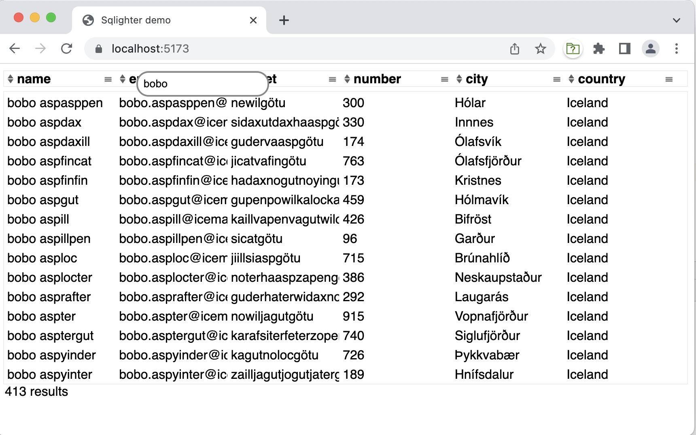

**Sqlighter**
* Inspired by a new feature in .Net blazor (see https://www.youtube.com/watch?v=lP_qdhAHFlg&t=300s)
* Creates a SQLite database file from any JDBC database or other tabular data
* So instead of a rest api serving json, enables binary download of data in native SQLite format
* So that SQLite in running in WASM (so in the browser) can be used to query the data.

**Why not use the sqlite code serverside for this purpose?**

*excellent question!*

But:
1. I would have to first create and SQLite database and fill it with results and then load the database file and serve it for http requests. While this should also work, it sounds as more overhead. In Sqlighter the data stays in memory. (yes, that's a problem if the data gets reallly BIG; considering offload to file)
2. Learning this shit is fun!
   * getting to know the fileformat. Most is nicely documented on https://sqlite.org (indeed, not everything)
   * variable length integer encoding
   * the nifty way strings and blobs are stored
   * I finally got my head around java nio (even though in the end I switched from ByteBuffer to plain byte arrays)
   * debugging this app lead me to debugging SQLite itself in xcode (really easy to set up btw). So I learnt a bit about that.

**Usable when:**
* you have quite a lot of (tabular) data, that is read-only, or does not need to be (ultra) realtime.
* and your users need to quickly apply different search criteria on it.
* Using Sqlighter avoids server roundtrips and improves the user experience.
* There is a utility to transfer a regular JDBC ResultSet to SQLite format, but using the API you could put any tabular data in. 
* Bear in mind that, while you, as a developer, cannot directly read the payload, like JSON allows, SQLite is available on pretty much any platform,
and then you can leverage the power of SQL to inspect the data. 

* other use case: you need to create an sqlite database from a file (like a CSV) in a java app. Sqlighter is much faster than jdbc+sqlite. There are no transactions, and no checks, so use at your own peril.
* Thing to note: Sqlite is really relaxed when it comes to schema validation. 
That means that 2 records in the same table can contain values of totally different types(!). The number of values can also vary. All perfectly legal from the standpoint of Sqlighter. 
And maybe not when writing to Sqlite itself, but perfectly readable!

**About the name**    
* It lights up an SQLite database :)

**Usage**
Creating a database is as simple as:
```java
DatabaseBuilder databaseBuilder = new DatabaseBuilder();
databaseBuilder.addSchema("foo",
    "CREATE TABLE foo(bar integer,baz varchar(10))");

Record record = new Record(Value.of(12), Value.of("helloworld"));
databaseBuilder.addRecord(record);

databaseBuilder.build().write("test.db");
```
* Instead of writing to file, you can also write to any `OutputStream`
  * testing with (direct) bytebuffers did not yield performance improvements for http requests (for http 1 and 2, tomcat and undertow).

**Be aware** 
* The schema and the actual data don't have to match! But that is how SQLite itself also works, pretty much.
* And: 2 records in the same table can contain values of totally different types(!). The number of values can also vary. All perfectly legal from the standpoint of Sqlighter.
  And maybe not when writing to Sqlite itself, but perfectly readable!
  * unittest SchemaCreationTests is proof of this.


**Current status**
* It works for tables of any size, but probably not for indexes (may skip that feature) because you can always add them client-side(!)

**Performance**
* Serverside the time that it costs is on par with [jackson](https://github.com/FasterXML/jackson):
  * that is: ~400 ms for a 9.3 Mb database (100,000 records, on my Mac m1, using jdk19/arm64)
  * versus ~430 ms using jackson (2.13.4) with the same data (payload size ~15.7Mb)
  * So it's even better, BUT in jdk11 (with rosetta) the numbers were roughly the other way around, so performing worse than jackson...
* The response payload size is roughly 60% of the JSON. (mileage may vary, depending on the content)
* It is comparing apples and pears though, because clientside it's way faster (and different).
* And, it's most probably not a good idea to use the format for smaller payloads.
  * I don't know currently where the cutoff point is.  

**DEMO**


* Uses spring boot, but that is not a prerequisite for sqlighter itself.
* see `start_api.sh` and `start_ui.sh`
* api on http://localhost:8080
* json on http://localhost:8080/api/customers (should provide a second ui that uses traditional json, for comparison)
* sqlite on http://localhost:8080/api/db/customers
  * TODO should rely on content-type negotiation

_Frontend_
* Now uses LIT, a web worker and OPFS and upraded to the official SQLite/WASM instead of SQL.js
* OPFS also requires https and extra headers (see vite.config.js).
* So far it works in Chrome and Firefox (as of V111 (I think, I only tested in 114)). Safari should but does not work (yet).
* it has some issues still, but it supports scrolling and filtering the complete dataset.

**Future plans?**
* There is now also a [rust](https://gitlab.com/sander-hautvast/sqlighte.rs) version... 
* and what about a javascript library that parses the format, so that you can render the data without sql? This could be a solution for medium sized payloads (and up) and when you just want to show the data without using the power of sql. It would be smaller than json, at least as performant and still accessible for humans with sqlite3.
